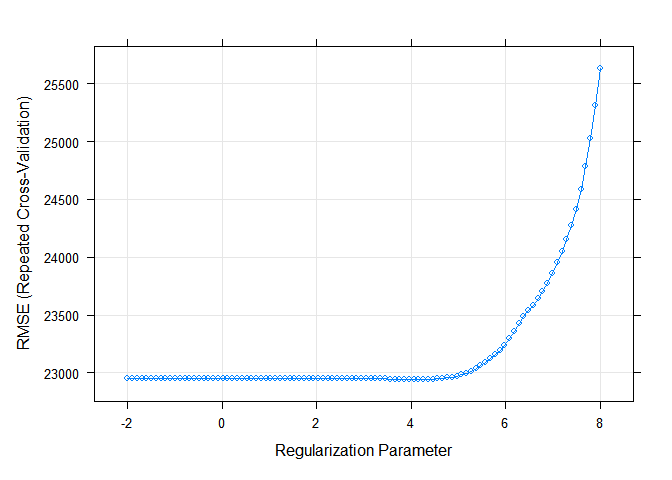

p8106_hw1_qz2266
================
Qing Zhou
2023-02-21

### Data Import and cleaning

In this exercise, we predict the sale price of a house using its other
characteristics. The training data are in “housing train.csv”, and the
test data are in “housing test.csv”.

``` r
# read in training data
train = read.csv("data/housing_training.csv") %>% 
janitor::clean_names()
train = na.omit(train)

# read in test data
test = read.csv("data/housing_test.csv") %>% 
janitor::clean_names()
test = na.omit(test)

# create covariates matrix for training and test
x_train = model.matrix(sale_price ~ ., train)[,-1]
y_train = train$sale_price
x_test <- model.matrix(sale_price ~ ., test)[ ,-1]
y_test <- test$sale_price
```

Check for potential collinearities among predictors in training data

``` r
# Correlation plot for all predictors
corrplot(cor(x_train), method = "circle", type = "full", tl.cex = 0.5)
```

<!-- -->
From the correlation plot we can see there are high correlations between
some of the covariates. This high correlation might cause collinearity
issue. To fix the potential multicollinearity issue, regularization
methods such as lasso, elastic net, or partial least squares could be
employed, other than linear model.

### a). Linear model

``` r
set.seed(1)

lm_fit = lm(sale_price ~ ., 
            data = train,
            method = "lm",
            trControl = trainControl(method = "repeatedcv", number = 10, repeats = 5))
summary(lm_fit)
```

    ## 
    ## Call:
    ## lm(formula = sale_price ~ ., data = train, method = "lm", trControl = trainControl(method = "repeatedcv", 
    ##     number = 10, repeats = 5))
    ## 
    ## Residuals:
    ##    Min     1Q Median     3Q    Max 
    ## -89864 -12424    416  12143 140205 
    ## 
    ## Coefficients: (1 not defined because of singularities)
    ##                              Estimate Std. Error t value Pr(>|t|)    
    ## (Intercept)                -4.985e+06  3.035e+06  -1.642  0.10076    
    ## gr_liv_area                 2.458e+01  1.393e+01   1.765  0.07778 .  
    ## first_flr_sf                4.252e+01  1.409e+01   3.017  0.00260 ** 
    ## second_flr_sf               4.177e+01  1.379e+01   3.029  0.00250 ** 
    ## total_bsmt_sf               3.519e+01  2.744e+00  12.827  < 2e-16 ***
    ## low_qual_fin_sf                    NA         NA      NA       NA    
    ## wood_deck_sf                1.202e+01  4.861e+00   2.474  0.01350 *  
    ## open_porch_sf               1.618e+01  1.004e+01   1.611  0.10736    
    ## bsmt_unf_sf                -2.087e+01  1.723e+00 -12.116  < 2e-16 ***
    ## mas_vnr_area                1.046e+01  4.229e+00   2.473  0.01353 *  
    ## garage_cars                 4.229e+03  1.893e+03   2.234  0.02563 *  
    ## garage_area                 7.769e+00  6.497e+00   1.196  0.23195    
    ## year_built                  3.251e+02  3.130e+01  10.388  < 2e-16 ***
    ## tot_rms_abv_grd            -3.838e+03  6.922e+02  -5.545 3.51e-08 ***
    ## full_bath                  -4.341e+03  1.655e+03  -2.622  0.00883 ** 
    ## overall_qualAverage        -5.013e+03  1.735e+03  -2.890  0.00391 ** 
    ## overall_qualBelow_Average  -1.280e+04  2.677e+03  -4.782 1.92e-06 ***
    ## overall_qualExcellent       7.261e+04  5.381e+03  13.494  < 2e-16 ***
    ## overall_qualFair           -1.115e+04  5.240e+03  -2.127  0.03356 *  
    ## overall_qualGood            1.226e+04  1.950e+03   6.287 4.30e-10 ***
    ## overall_qualVery_Excellent  1.304e+05  8.803e+03  14.810  < 2e-16 ***
    ## overall_qualVery_Good       3.798e+04  2.741e+03  13.852  < 2e-16 ***
    ## kitchen_qualFair           -2.663e+04  6.325e+03  -4.210 2.71e-05 ***
    ## kitchen_qualGood           -1.879e+04  4.100e+03  -4.582 5.01e-06 ***
    ## kitchen_qualTypical        -2.677e+04  4.281e+03  -6.252 5.37e-10 ***
    ## fireplaces                  1.138e+04  2.257e+03   5.043 5.18e-07 ***
    ## fireplace_quFair           -7.207e+03  6.823e+03  -1.056  0.29106    
    ## fireplace_quGood            6.070e+02  5.833e+03   0.104  0.91713    
    ## fireplace_quNo_Fireplace    3.394e+03  6.298e+03   0.539  0.59002    
    ## fireplace_quPoor           -5.185e+03  7.399e+03  -0.701  0.48362    
    ## fireplace_quTypical        -6.398e+03  5.897e+03  -1.085  0.27814    
    ## exter_qualFair             -3.854e+04  8.383e+03  -4.598 4.66e-06 ***
    ## exter_qualGood             -1.994e+04  5.585e+03  -3.569  0.00037 ***
    ## exter_qualTypical          -2.436e+04  5.874e+03  -4.147 3.57e-05 ***
    ## lot_frontage                1.024e+02  1.905e+01   5.376 8.90e-08 ***
    ## lot_area                    6.042e-01  7.864e-02   7.683 2.91e-14 ***
    ## longitude                  -3.481e+04  2.537e+04  -1.372  0.17016    
    ## latitude                    5.874e+04  3.483e+04   1.686  0.09193 .  
    ## misc_val                    9.171e-01  1.003e+00   0.914  0.36071    
    ## year_sold                  -6.455e+02  4.606e+02  -1.401  0.16132    
    ## ---
    ## Signif. codes:  0 '***' 0.001 '**' 0.01 '*' 0.05 '.' 0.1 ' ' 1
    ## 
    ## Residual standard error: 22190 on 1401 degrees of freedom
    ## Multiple R-squared:  0.9116, Adjusted R-squared:  0.9092 
    ## F-statistic: 380.3 on 38 and 1401 DF,  p-value: < 2.2e-16

``` r
# prediction
pred_lm = predict(lm_fit, newdata = test)

# test error


lm_rmse = RMSE(pred_lm, test$sale_price); lm_rmse
```

    ## [1] 21149.18

``` r
mse = (lm_rmse^2); mse
```

    ## [1] 447287652

Pros and cons of the linear model: 1. This model is quite
straightforward and easy to fit.The estimates are BLUE. However, this
model is still complicated with too many predictors. Moreover, there are
multicollinearity issue and overfitting problem.

### b). Lasso model

#### lasso model 1 based on lambda min

``` r
set.seed(1)

lasso_fit = train(x_train, y_train, 
                    method = "glmnet",
                    tuneGrid = expand.grid(alpha = 1,
                                           lambda = exp(seq(-2, 8, length = 100))),
                    trControl = trainControl(method = "repeatedcv", number = 10, repeats = 5))

plot(lasso_fit, xTrans = log)
```

<!-- -->

``` r
# optimal tuning parameters
lasso_fit$bestTune
```

    ##    alpha   lambda
    ## 62     1 64.17516

``` r
# show coefficients
coef(lasso_fit$finalModel, lasso_fit$bestTune$lambda)
```

    ## 40 x 1 sparse Matrix of class "dgCMatrix"
    ##                                       s1
    ## (Intercept)                -4.830346e+06
    ## gr_liv_area                 6.540238e+01
    ## first_flr_sf                8.016798e-01
    ## second_flr_sf               .           
    ## total_bsmt_sf               3.541418e+01
    ## low_qual_fin_sf            -4.095881e+01
    ## wood_deck_sf                1.164153e+01
    ## open_porch_sf               1.544655e+01
    ## bsmt_unf_sf                -2.088792e+01
    ## mas_vnr_area                1.089192e+01
    ## garage_cars                 4.086270e+03
    ## garage_area                 8.161397e+00
    ## year_built                  3.233663e+02
    ## tot_rms_abv_grd            -3.620617e+03
    ## full_bath                  -3.849455e+03
    ## overall_qualAverage        -4.856601e+03
    ## overall_qualBelow_Average  -1.246350e+04
    ## overall_qualExcellent       7.545290e+04
    ## overall_qualFair           -1.075910e+04
    ## overall_qualGood            1.212418e+04
    ## overall_qualVery_Excellent  1.356218e+05
    ## overall_qualVery_Good       3.789366e+04
    ## kitchen_qualFair           -2.487155e+04
    ## kitchen_qualGood           -1.723010e+04
    ## kitchen_qualTypical        -2.533814e+04
    ## fireplaces                  1.055908e+04
    ## fireplace_quFair           -7.669876e+03
    ## fireplace_quGood            .           
    ## fireplace_quNo_Fireplace    1.462970e+03
    ## fireplace_quPoor           -5.644087e+03
    ## fireplace_quTypical        -7.011684e+03
    ## exter_qualFair             -3.340938e+04
    ## exter_qualGood             -1.515968e+04
    ## exter_qualTypical          -1.959557e+04
    ## lot_frontage                9.969303e+01
    ## lot_area                    6.042705e-01
    ## longitude                  -3.296544e+04
    ## latitude                    5.514849e+04
    ## misc_val                    8.297428e-01
    ## year_sold                  -5.617527e+02

``` r
# prediction
pred_lasso = predict(lasso_fit, newdata = x_test)
# test error
lasso_mse = mean((pred_lasso - y_test)^2); lasso_mse
```

    ## [1] 440092572

``` r
# number of predictors
num_coef = coef(lasso_fit$finalModel, lasso_fit$bestTune$lambda) 
sum(num_coef != 0) - 1
```

    ## [1] 37

#### lasso model 2 based on 1SE

``` r
set.seed(1)

lasso_1se = train(x_train, y_train, 
                  method = "glmnet",
                  tuneGrid = expand.grid(alpha = 1,
                                         lambda = exp(seq(-2, 8, length = 100))),
                  trControl =  trainControl(method = "repeatedcv", selectionFunction = "oneSE", number = 10, repeats = 5))
                  
# optimal tuning parameters based on 1se rule
lasso_1se$bestTune
```

    ##    alpha   lambda
    ## 80     1 395.3605

``` r
# show coefficients 
coef(lasso_1se$finalModel, lasso_1se$bestTune$lambda)
```

    ## 40 x 1 sparse Matrix of class "dgCMatrix"
    ##                                       s1
    ## (Intercept)                -3.943441e+06
    ## gr_liv_area                 6.108086e+01
    ## first_flr_sf                9.449637e-01
    ## second_flr_sf               .           
    ## total_bsmt_sf               3.625951e+01
    ## low_qual_fin_sf            -3.544140e+01
    ## wood_deck_sf                1.004751e+01
    ## open_porch_sf               1.213017e+01
    ## bsmt_unf_sf                -2.060701e+01
    ## mas_vnr_area                1.293690e+01
    ## garage_cars                 3.503770e+03
    ## garage_area                 9.711868e+00
    ## year_built                  3.152712e+02
    ## tot_rms_abv_grd            -2.541684e+03
    ## full_bath                  -1.469004e+03
    ## overall_qualAverage        -4.028703e+03
    ## overall_qualBelow_Average  -1.088208e+04
    ## overall_qualExcellent       8.701702e+04
    ## overall_qualFair           -8.812993e+03
    ## overall_qualGood            1.113742e+04
    ## overall_qualVery_Excellent  1.557578e+05
    ## overall_qualVery_Good       3.731931e+04
    ## kitchen_qualFair           -1.452506e+04
    ## kitchen_qualGood           -7.943206e+03
    ## kitchen_qualTypical        -1.672289e+04
    ## fireplaces                  8.251261e+03
    ## fireplace_quFair           -3.942182e+03
    ## fireplace_quGood            2.111321e+03
    ## fireplace_quNo_Fireplace    .           
    ## fireplace_quPoor           -1.621801e+03
    ## fireplace_quTypical        -4.236539e+03
    ## exter_qualFair             -1.699637e+04
    ## exter_qualGood              .           
    ## exter_qualTypical          -4.789838e+03
    ## lot_frontage                8.694872e+01
    ## lot_area                    5.920132e-01
    ## longitude                  -2.270960e+04
    ## latitude                    3.807773e+04
    ## misc_val                    3.236657e-01
    ## year_sold                  -1.732609e+02

``` r
# prediction
pred_lasso_1se = predict(lasso_1se, newdata = x_test)
# test error
lasso_1se_mse = mean((pred_lasso_1se - y_test)^2); lasso_1se_mse
```

    ## [1] 420909622

``` r
# number of predictors
num_coef_1se = coef(lasso_1se$finalModel, lasso_1se$bestTune$lambda) 
sum(num_coef_1se != 0) - 1
```

    ## [1] 36

There are 37 predictors in lasso model 1 based on lambda min and 36
predictors in lasso model 2 based on 1se rule. The selected turing
parameter for lowest cv rmse is 64.18 while the 1se rule gives lambda of
395.36. Lasso model 2 based on 1se rule has smaller test MSE which is
4.2090962^{8} than lasso model 1 based on lambda min which is
4.4009257^{8}. Therefore, lasso model 2 based on 1se is better.
